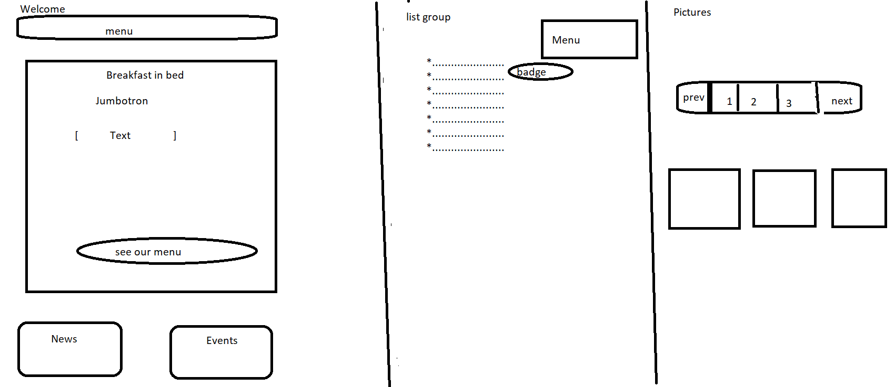
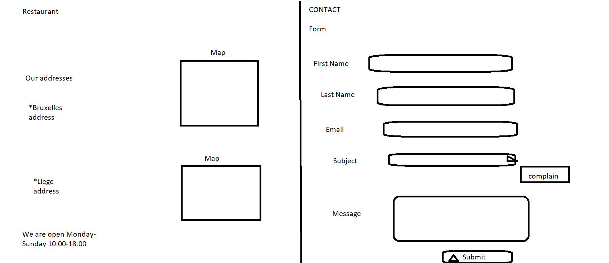
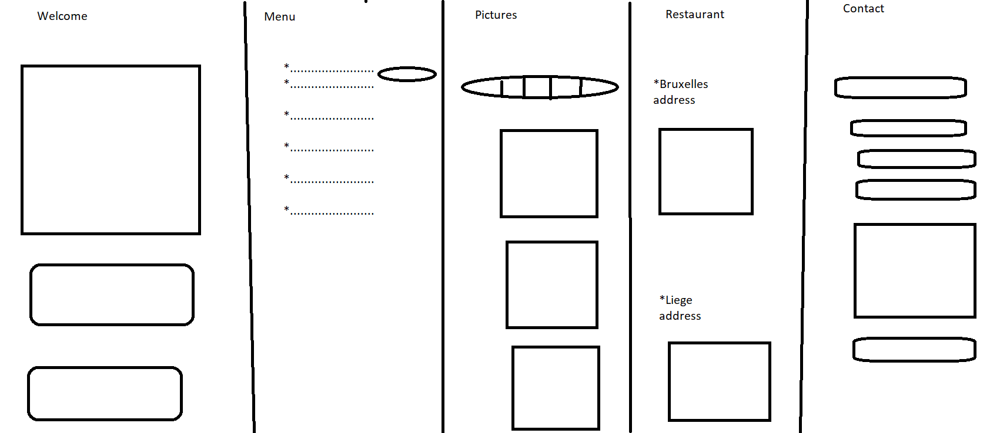

### RESTAURANT "BREAKFAST IN BED"

​	This project is a restaurant which serves breakfast and I chose this theme because I especially love to go out and eat a nice breakfast.

​	You can see my site [here](https://adriana-lazurca.github.io/restaurant-css-framework/home) 

##### The mission
The project started on 28/01/2021 and ended on 02/02/2021.
The website must be responsive, at least for small and medium screens. It must at least have five accessible pages: welcome, menu, pictures, restaurants and contact; __Botrstrap__ is the main used technology.

##### Used technologies
**Git and GitHub*
**Visual Studio Code*
**HTML 5*
**CSS 3*
**Bootrsrap*
**Font Awesome*

##### Credits:
-the pictures used in the project are from [Unsplash](https://unsplash.com/) 
-the logo was edited with [FreeLogo Design](https://www.freelogodesign.org/) 

Bellow are the __sketches__ I used as a plan for my project:

I. **Desktop**
&nbsp;

&nbsp;

&nbsp;

II. **Mobile**
&nbsp;

&nbsp;

 

 